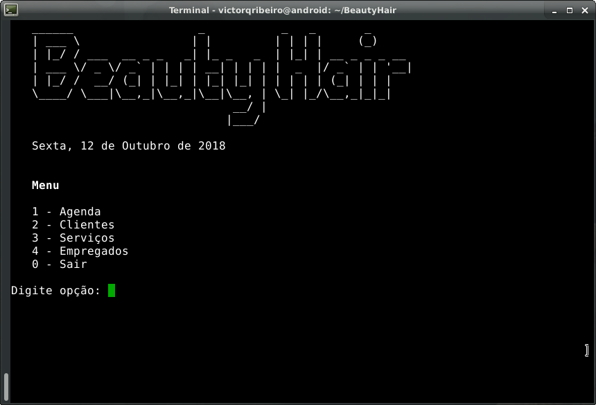
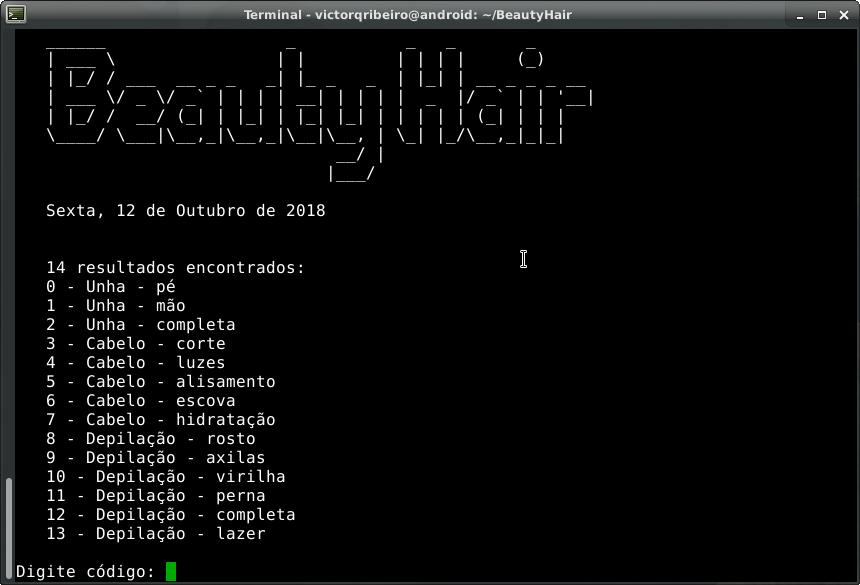
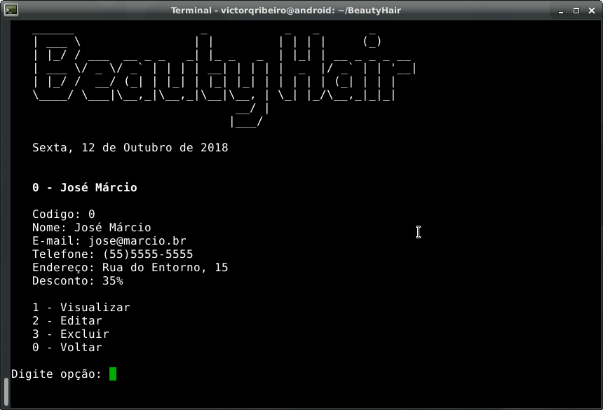
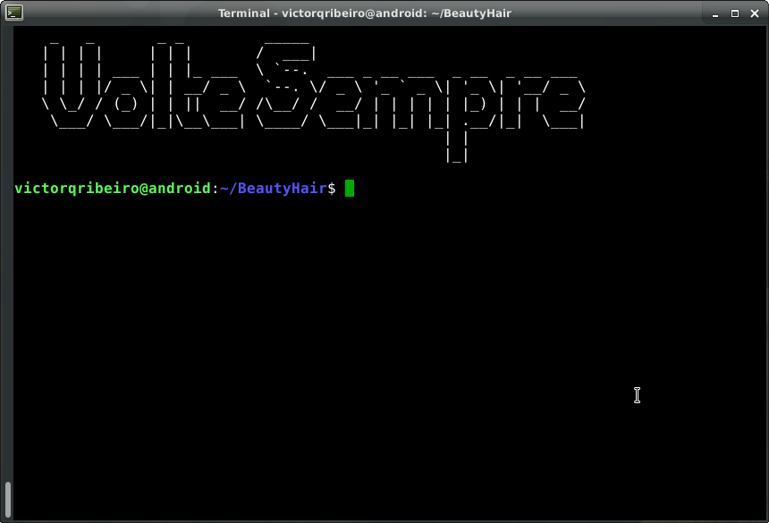

# BeautyHair

BeautyHair is a multiplatform software written in Java to manage beauty saloons.
It is a project made in my Object Oriented Programming class at the university.
It is in portuguese, cause I'm brazilian, and in CLI because I love old computers.



## How To Run

In linux you run
```
BeautyHair.sh
```
and on Windows
```
BeautyHair.bat
```
or you can just run java
```
java BeautyHair
```

## How to Compile

Navigate to the BeautyHair folder and enter the following command

```
javac -d . *.java -encoding UTF8
```

You can manage services, clients, employees, schedules, money...






